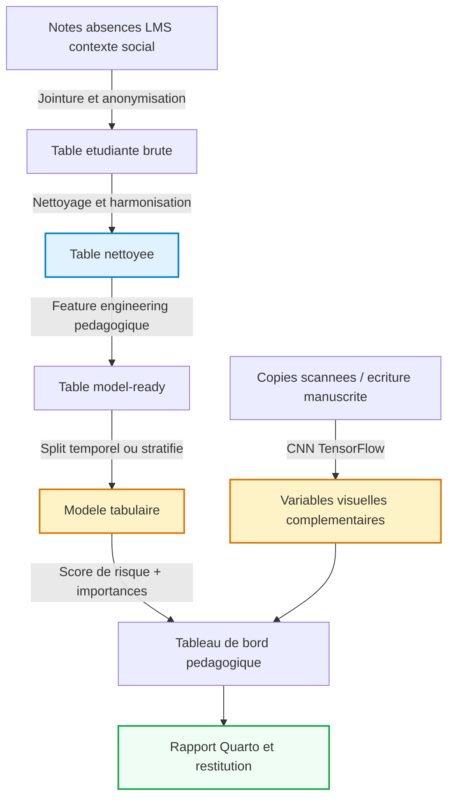

# Mon Projet Data Science
Étudiant(e) 1 : Hugo RAGUIN, Étudiant(e) 2 : Amine TALEB, Étudiant(e) 3
: Elliot FIORESE
2026-05-18

- [Introduction et Contexte Métier](#sec-intro)
  - [Contexte du Projet](#contexte-du-projet)
  - [Objectif Analytique](#objectif-analytique)
  - [Synthèse](#synthèse)
  - [Positionnement par Rapport au Cahier des
    Charges](#positionnement-par-rapport-au-cahier-des-charges)
- [Acquisition et Préparation des Données (Data
  Wrangling)](#sec-wrangling)
  - [Audit de Qualité](#audit-de-qualité)
  - [Algorithme de Nettoyage](#algorithme-de-nettoyage)
  - [Travaux Pratiques de Wrangling](#travaux-pratiques-de-wrangling)
- [Analyse Exploratoire des Données (EDA)](#sec-eda)
  - [Statistiques Descriptives](#statistiques-descriptives)
  - [Ingénierie de Variables (Feature
    Engineering)](#ingénierie-de-variables-feature-engineering)
  - [Travaux Pratiques d’Exploration Visuelle
    (EDA)](#travaux-pratiques-dexploration-visuelle-eda)
- [Visualisation Multidimensionnelle (Insights)](#sec-viz)
  - [Profils et Distributions
    Caractéristiques](#profils-et-distributions-caractéristiques)
  - [Corrélations Globales](#corrélations-globales)
- [Modélisation et Apprentissage](#sec-modelling)
  - [Schéma Global du Pipeline de
    Données](#schéma-global-du-pipeline-de-données)
  - [Modélisation Tabulaire (Machine
    Learning)](#modélisation-tabulaire-machine-learning)
  - [Modélisation Vision / Deep Learning (Analyse d’Images ou
    Signaux)](#modélisation-vision--deep-learning-analyse-dimages-ou-signaux)
- [Évaluation Métrique et Validation](#sec-evaluation)
  - [Stratégie de Validation](#stratégie-de-validation)
  - [Validation Croisée Stratifiée](#validation-croisée-stratifiée)
  - [Résultats et Interprétation](#résultats-et-interprétation)
- [Data Storytelling et Communication](#sec-storytelling)
  - [Tableau de Bord Interactif](#tableau-de-bord-interactif)
  - [Matrice d’Action Pédagogique](#matrice-daction-pédagogique)
  - [Recommandations Stratégiques /
    Métier](#recommandations-stratégiques--métier)
  - [Limites et Perspectives](#limites-et-perspectives)
  - [Supports de Restitution](#supports-de-restitution)
- [Bibliographie](#bibliographie)

# Introduction et Contexte Métier

Le sujet principal retenu pour ce projet est la **prédiction du risque
d’abandon scolaire ou d’échec académique**. La problématique métier
consiste à identifier le plus tôt possible les étudiants à risque afin
de déclencher des actions ciblées: tutorat, suivi pédagogique,
accompagnement social ou adaptation du rythme d’apprentissage.

L’enjeu n’est pas uniquement de prédire une cible binaire. Il s’agit
aussi de construire une chaîne analytique défendable, lisible par une
équipe pédagogique et exploitable pour l’aide à la décision. Le livrable
final doit donc articuler nettoyage de données, exploration explicative,
modélisation tabulaire et ouverture vers une brique vision liée à des
copies scannées ou à de l’écriture manuscrite.

## Contexte du Projet

Le domaine d’étude est celui de l’**analytics éducatif**. Un
établissement d’enseignement ou un service de réussite étudiante dispose
souvent de données fragmentées: notes continues, absences, retard dans
les remises, temps de connexion à une plateforme pédagogique,
participation en classe, statut boursier, parcours antérieur ou
indicateurs socio-économiques. Isolément, ces variables sont peu
actionnables; combinées, elles permettent de détecter des signaux
faibles de décrochage.

Ce sujet est pertinent scientifiquement et stratégiquement. Il répond à
un besoin réel de prévention, mobilise des variables tabulaires
hétérogènes, soulève des questions de biais et d’équité, et se prête
naturellement à une extension multimodale via l’analyse de copies
numérisées, de formulaires pédagogiques ou d’écritures manuscrites.

## Objectif Analytique

La cible principale sera une variable de type `dropout_risk`,
`failure_risk` ou `success_status`, selon le jeu de données final
retenu. Le problème est donc formulé comme une **classification
supervisée**, éventuellement complétée par une analyse de probabilité de
risque pour prioriser les interventions pédagogiques.

Les livrables analytiques sont les suivants:

- un jeu de données nettoyé et un jeu de données prêt pour la
  modélisation;
- des indicateurs descriptifs et des visualisations métier sur
  l’assiduité, les résultats académiques et l’engagement étudiant;
- un modèle de classification de référence comparé à une baseline naïve
  pour repérer les profils à risque;
- une brique CNN documentée, pensée pour être raccordée à des copies
  scannées, de l’écriture manuscrite ou des documents pédagogiques
  numérisés.

> Note méthodologique: le pipeline tabulaire repose sur le jeu UCI
> *Predict Students’ Dropout and Academic Success*, harmonisé vers le
> schéma analytique du projet. Un générateur synthétique local est
> conservé comme solution de repli afin d’assurer l’exécution du
> pipeline si la source publique devient indisponible.

## Synthèse

Le travail mené couvre les deux jalons du projet autour d’un même cas
d’usage: la détection précoce du risque de décrochage étudiant.
L’ensemble de la démarche articule préparation de données, analyse
exploratoire, modélisation supervisée et ouverture vers une composante
vision par ordinateur.

Les principaux résultats obtenus peuvent être résumés ainsi:

- le pipeline aboutit à une base étudiante cohérente, nettoyée et
  enrichie par des variables dérivées interprétables;
- l’analyse exploratoire met en évidence des contrastes nets selon les
  programmes, le statut boursier et la dynamique semestrielle;
- la régression logistique constitue le meilleur compromis pour une
  logique d’alerte précoce, avec un rappel de **0,806** et un ROC-AUC de
  **0,909** sur le jeu de test;
- la branche CNN, encore démonstrative, confirme la faisabilité
  technique d’une extension future vers des documents pédagogiques
  numérisés.

## Positionnement par Rapport au Cahier des Charges

| Dimension attendue | Traitement retenu dans ce rapport | Supports mobilisés |
|----|----|----|
| Préparation des données | Audit des manques, imputation, création de variables dérivées et encodage pour la modélisation | [src/student_risk_dataset.py](src/student_risk_dataset.py), [src/tp1_student_wrangling.py](src/tp1_student_wrangling.py) |
| Analyse exploratoire | Statistiques descriptives, profils par programme, distributions et corrélations | [src/tp2_student_eda.py](src/tp2_student_eda.py), tableaux de `data/processed` |
| Visualisation | Figures métier générées à partir du schéma harmonisé du projet | [src/generate_report_figures.py](src/generate_report_figures.py), figures du dossier `report/assets` |
| Modélisation | Comparaison entre baseline, régression logistique et Random Forest | [src/tp3_student_modelisation.py](src/tp3_student_modelisation.py) |
| Évaluation | Lecture conjointe de l’accuracy, du rappel, du F1-score et du ROC-AUC | `data/processed/tp3_model_metrics.csv` |
| Restitution | Interprétation métier, matrice d’action pédagogique et discussion des limites | sections d’analyse et de storytelling du présent rapport |

Cette structuration permet de maintenir une continuité entre les
attendus pédagogiques du cours et la progression réelle de l’étude, sans
dissocier artificiellement les phases exploratoires, prédictives et de
communication.

------------------------------------------------------------------------

# Acquisition et Préparation des Données (Data Wrangling)

Le succès de tout projet de Data Science repose sur la qualité de la
préparation des données ([McKinney 2020](#ref-pandas2020)). Cette
section documente l’audit de qualité et les étapes de nettoyage
appliquées à vos jeux de données bruts.

## Audit de Qualité

Le jeu brut harmonisé retenu par défaut contient **4 424 étudiants** et
**16 variables**, avec une cible `dropout_risk` égale à **32,1 %** de la
population (**1 421 étudiants à risque** sur 4 424). Les identifiants du
projet sont reconstruits lors de l’harmonisation afin de garantir
l’unicité locale et la traçabilité du pipeline.

Sur les variables retenues dans ce schéma harmonisé, aucune valeur
manquante structurante n’est observée. Le contrôle de complétude
confirme que les colonnes tabulaires conservées sont renseignées sur
l’ensemble de la cohorte.

Le wrangling reste néanmoins indispensable. Il stabilise les types,
normalise les booléens, prépare les variables dérivées et conserve une
logique d’imputation compatible avec le dataset synthétique de secours
ou avec d’autres sources qui seraient moins propres que l’archive UCI.

## Algorithme de Nettoyage

Le pipeline de nettoyage est implémenté dans
[src/student_risk_dataset.py](src/student_risk_dataset.py) et
[src/tp1_student_wrangling.py](src/tp1_student_wrangling.py). La
logique retenue est la suivante:

1.  harmonisation d’un dataset public existant quand il est demandé,
    avec repli automatique vers un dataset brut réaliste généré
    localement;
2.  normalisation des booléens et conversion robuste des colonnes
    numériques;
3.  création de drapeaux de non-réponse pour `attendance_rate`,
    `prior_average` et `continuous_assessment`;
4.  imputation médiane sur les variables quantitatives, `False` sur les
    booléens et `Unknown` sur les catégories;
5.  création de variables dérivées interprétables: `engagement_score`,
    `grade_trend_gap` et `academic_pressure_index`;
6.  encodage one-hot des variables catégorielles pour obtenir une table
    directement exploitable par Scikit-Learn.

Le pipeline ne supprime aucune ligne: la cohorte complète de **4 424
étudiants** est conservée. La sortie wranglée contient **22 colonnes**
et la table `model_ready` **37 colonnes**.

## Travaux Pratiques de Wrangling

Le script de wrangling génère deux sorties versionnées:

- `data/processed/tp1_student_risk_wrangled.csv` pour l’analyse métier;
- `data/processed/tp1_student_risk_model_ready.csv` pour la modélisation
  supervisée.

Cette séparation est particulièrement importante dans un contexte
éducatif, car les enseignants et responsables de formation doivent
pouvoir relire les données et comprendre les transformations appliquées.

------------------------------------------------------------------------

# Analyse Exploratoire des Données (EDA)

Dans cette section, nous analysons les relations statistiques
fondamentales qui régissent votre domaine d’étude au sein du jeu de
données.

## Statistiques Descriptives

Le profil moyen observé est celui d’un étudiant de **23,27 ans**,
travaillant **17,01 heures par semaine**, se connectant **14,77 fois par
semaine** au LMS, avec un **taux d’assiduité moyen de 78,74 %** et un
**délai moyen de remise de 1,42 jour**. La note antérieure moyenne est
de **13,26/20** et l’évaluation continue moyenne de **10,75/20**.

| Programme (exemples contrastés) | Assiduité moyenne | Évaluation continue moyenne | Taux de risque |
|----|---:|---:|---:|
| Nursing | 86.24 % | 12.52 | 15.4 % |
| Social Service | 83.93 % | 11.35 | 18.3 % |
| Informatics Engineering | 66.57 % | 9.38 | 54.1 % |
| Biofuel Production Technologies | 66.63 % | 10.19 | 66.7 % |

Le contraste métier est net: `Nursing` et `Social Service` restent
relativement protégés, alors que `Informatics Engineering` et surtout
`Biofuel Production Technologies` concentrent les niveaux de risque les
plus élevés. Cette hétérogénéité plaide pour une lecture segmentée par
programme, et non pour une politique uniforme de prévention.

## Ingénierie de Variables (Feature Engineering)

L’ingénierie de variables transforme ici les traces brutes en signaux
pédagogiques exploitables. Trois variables ont été construites
explicitement:

- `engagement_score`, qui combine assiduité, temps de travail, activité
  LMS et retards de remise;
- `grade_trend_gap`, qui mesure l’écart entre l’évaluation continue et
  la moyenne antérieure;
- `academic_pressure_index`, qui agrège stress, retards et dégradation
  d’assiduité.

Ces variables dérivées ont deux avantages. Elles améliorent la capacité
prédictive du modèle, mais surtout elles restent compréhensibles par les
équipes éducatives. Une alerte fondée sur la baisse des notes, la chute
d’engagement et la hausse de pression académique est plus défendable
qu’un score opaque.

## Travaux Pratiques d’Exploration Visuelle (EDA)

L’exploration visuelle est calculée dans
[src/tp2_student_eda.py](src/tp2_student_eda.py) et mise en forme
dans
[src/generate_report_figures.py](src/generate_report_figures.py). Les
visuels générés dans `report/assets` documentent le cas d’étude étudiant
retenu dans ce rapport.

------------------------------------------------------------------------

# Visualisation Multidimensionnelle (Insights)

Nous présentons ici les visualisations cibles du projet et la manière
dont elles doivent être interprétées pour une cellule de réussite
étudiante.

L’EDA montre que le risque académique n’est pas aléatoire. Il se
concentre sur quelques dimensions stables: performance récente,
assiduité, engagement numérique et contexte socio-éducatif.

## Profils et Distributions Caractéristiques

Trois insights ressortent immédiatement:

- le statut boursier joue un rôle protecteur marqué dans ce dataset:
  **38,71 %** des non-boursiers sont classés à risque contre **12,19 %**
  des boursiers;
- le risque n’est pas homogène selon les programmes:
  `Biofuel Production Technologies` atteint **66,7 %** contre **15,4 %**
  pour `Nursing`;
- la structure du jeu UCI met surtout en évidence les deux premiers
  semestres observés, avec **42,78 %** de risque au semestre 1 contre
  **31,67 %** au semestre 2.

Ces contrastes justifient le recours à un score de risque multicritère,
plutôt qu’à une lecture limitée à la moyenne générale.

## Corrélations Globales

La matrice de corrélation met en évidence plusieurs relations
structurantes. La plus forte corrélation observée est celle entre
`prior_average` et `continuous_assessment` (**0,756**), ce qui est
cohérent avec la continuité du niveau académique. À l’inverse,
`assignment_delay_days` est négativement corrélé à
`continuous_assessment` (**-0,386**) et à `prior_average` (**-0,360**),
ce qui renforce l’idée que les retards de remise sont un bon proxy de
fragilité. La matrice de corrélation met en évidence plusieurs relations
structurantes. La plus forte corrélation observée est logiquement celle
entre `study_hours_per_week` et `engagement_score` (**0,920**), puisque
ce score intègre explicitement le volume de travail. Parmi les relations
plus interprétables, `attendance_rate` est fortement corrélée à
`continuous_assessment` (**0,771**) et négativement à `stress_index`
(**-0,776**). À l’inverse, `assignment_delay_days` reste négativement
corrélé à `attendance_rate` (**-0,387**) et à `engagement_score`
(**-0,424**), ce qui renforce l’idée que les retards de remise capturent
une fragilité organisationnelle.

L’objectif n’est donc pas seulement descriptif. Cette lecture permet
aussi d’identifier les variables redondantes, les dépendances fortes et
les agrégations utiles pour la modélisation.

------------------------------------------------------------------------

# Modélisation et Apprentissage

## Schéma Global du Pipeline de Données

Le pipeline complet intègre à la fois la branche analytique tabulaire
(Machine Learning) et la branche d’analyse visuelle ou de signaux
complexes (Deep Learning CNN) :

## Modélisation Tabulaire (Machine Learning)

La branche tabulaire est implémentée dans
[src/tp3_student_modelisation.py](src/tp3_student_modelisation.py).
Trois modèles sont comparés:

- une baseline majoritaire, pour mesurer le niveau minimal de référence;
- une régression logistique, plus adaptée à une lecture opérationnelle
  centrée sur le rappel;
- une forêt aléatoire, utilisée ici pour sa robustesse et pour le
  classement des variables explicatives.

Le protocole retenu combine deux niveaux d’évaluation complémentaires.
Un **split stratifié en 80/20** est conservé pour estimer la performance
finale sur un jeu de test indépendant. En parallèle, une **validation
croisée stratifiée à 5 plis** est réalisée sur l’échantillon
d’entraînement afin de comparer les modèles sur plusieurs
sous-échantillons et de réduire la dépendance à un découpage unique. Sur
un dataset réel multi-semestres, ce protocole devrait ensuite évoluer
vers un découpage chronologique ou par cohorte.

Les variables les plus influentes dans la forêt aléatoire sont
`attendance_rate` (**0,167**), `academic_pressure_index` (**0,145**),
`engagement_score` (**0,112**), `stress_index` (**0,099**) et
`study_hours_per_week` (**0,081**). Le modèle capture donc un mélange
cohérent d’**assiduité**, de **pression académique** et d’**engagement
pédagogique**.

### Travaux Pratiques de Modélisation Tabulaire

La modélisation produit trois sorties clés dans `data/processed`:

- `tp3_model_metrics.csv` pour les scores comparatifs;
- `tp3_cross_validation_metrics.csv` pour la synthèse de validation
  croisée stratifiée;
- `tp3_feature_importance.csv` pour le classement des variables;
- `tp3_predictions_sample.csv` pour un échantillon de prédictions
  individuelles.

## Modélisation Vision / Deep Learning (Analyse d’Images ou Signaux)

La branche Deep Learning est implémentée dans
[src/tp4_synthetic_cnn.py](src/tp4_synthetic_cnn.py). À ce stade,
elle sert de **preuve de faisabilité technique** pour l’intégration
d’une chaîne vision dans le même environnement reproductible que la
branche tabulaire.

Le script génère aujourd’hui **120 images RGB synthétiques** de taille
$64 \times 64$ réparties en deux classes simples. Cette approche n’est
pas la finalité métier du projet; elle prépare plutôt l’étape suivante,
dans laquelle le CNN pourra être appliqué à des copies scannées, à de
l’écriture manuscrite, à des formulaires pédagogiques ou à des traces
visuelles issues d’un environnement d’apprentissage.

L’architecture CNN reste volontairement compacte:

- bloc `Conv2D(16)` + `MaxPooling2D`;
- bloc `Conv2D(32)` + `MaxPooling2D`;
- `Flatten`, `Dense(32)`, `Dropout(0.2)`, puis sortie sigmoïde.

Le modèle est entraîné sur **96 images** et validé sur **24 images**. Il
atteint une **accuracy de validation de 1,00** et une `validation_loss`
finale très faible lors des exécutions Docker du projet. Ce score est
cohérent avec la simplicité du problème visuel utilisé comme
démonstrateur. Il valide la chaîne TensorFlow, mais ne constitue pas
encore un résultat métier sur des documents éducatifs réels.

### Travaux Pratiques de Vision par Ordinateur (CNN)

Les sorties de cette branche sont exportées dans
`data/processed/tp4_cnn_history.csv`,
`data/processed/tp4_cnn_metrics.csv` et
`data/processed/tp4_cnn_predictions.csv`, ainsi que dans deux figures du
dossier `report/assets`.

------------------------------------------------------------------------

# Évaluation Métrique et Validation

## Stratégie de Validation

La validation de la branche tabulaire repose ici sur un protocole en
deux temps. D’abord, les modèles sont comparés par **validation croisée
stratifiée à 5 plis** sur l’échantillon d’entraînement, ce qui permet
d’observer la stabilité des métriques sur plusieurs découpages. Ensuite,
le modèle retenu est réévalué sur un **jeu de test hold-out stratifié
80/20**, conservé à l’écart de la phase de sélection.

Ce choix est cohérent avec le jeu UCI harmonisé par défaut, qui agrège
des informations d’inscription et de performance sur les deux premiers
semestres au sein d’un même établissement. Dans un cadre réel
multi-cohortes, il faudrait néanmoins renforcer encore le protocole en
privilégiant un découpage chronologique, par cohorte ou par groupe
pédagogique afin d’éviter toute fuite d’information entre périodes
d’observation.

Pour la branche CNN, le démonstrateur actuel repose sur un hold-out
80/20. Dans un contexte éducatif réel, cette brique devra être évaluée
soit par validation croisée, soit sur un jeu de documents réellement
séparé par session, matière ou promotion.

## Validation Croisée Stratifiée

| Modèle                | Accuracy CV | Recall CV | F1 CV | ROC-AUC CV |
|-----------------------|------------:|----------:|------:|-----------:|
| Baseline majoritaire  |       0.679 |     0.000 | 0.000 |      0.500 |
| Régression logistique |       0.849 |     0.806 | 0.774 |      0.903 |
| Random Forest         |       0.855 |     0.703 | 0.757 |      0.900 |

La validation croisée confirme un arbitrage plus serré que sur la
version synthétique du projet. La régression logistique reste la mieux
alignée avec une logique d’alerte précoce, car elle maintient un
**rappel moyen de 0,806** tout en conservant un **ROC-AUC de 0,903**. La
forêt aléatoire est compétitive en accuracy moyenne (**0,855** contre
**0,849**), mais son rappel moyen descend à **0,703**, ce qui reste
moins favorable si l’objectif prioritaire est de détecter le maximum
d’étudiants fragiles.

## Résultats et Interprétation

Les métriques prioritaires sont la **précision**, le **rappel**, le
**F1-score** et le **ROC-AUC**, car le coût d’une erreur n’est pas
symétrique. Un faux négatif signifie qu’un étudiant à risque n’est pas
détecté; un faux positif signifie qu’un étudiant reçoit un suivi
inutile.

| Modèle                | Accuracy | Rappel | F1-score | ROC-AUC |
|-----------------------|---------:|-------:|---------:|--------:|
| Baseline majoritaire  |    0.679 |  0.000 |    0.000 |     N/A |
| Régression logistique |    0.851 |  0.806 |    0.776 |   0.909 |
| Random Forest         |    0.856 |  0.715 |    0.762 |   0.909 |

Le résultat clé est que **la régression logistique reste le meilleur
choix opérationnel** pour un système d’alerte précoce. Elle offre le
meilleur rappel (**0,806**) tout en conservant un **ROC-AUC de 0,909**,
ce qui signifie qu’elle détecte davantage d’étudiants à risque. La forêt
aléatoire obtient une accuracy légèrement supérieure (**0,856**) ainsi
qu’une précision plus élevée (**0,815**), mais son rappel (**0,715**)
laisse échapper davantage d’étudiants fragiles.

Ce compromis est cohérent avec le métier: un système d’alerte précoce
supporte souvent un rappel élevé, quitte à assumer davantage de faux
positifs, parce que le coût d’une intervention pédagogique légère reste
inférieur au coût d’un abandon non détecté.

------------------------------------------------------------------------

# Data Storytelling et Communication

## Tableau de Bord Interactif

Pour compléter les figures statiques du rapport, un tableau de bord
interactif autonome a été ajouté au projet. Il rassemble dans une même
interface les métriques du jeu de test, les résultats de validation
croisée, les variables explicatives dominantes, les profils de risque
par programme et une liste prioritaire d’étudiants à suivre.

Le tableau de bord interactif est disponible dans le fichier suivant:
[Dashboard interactif](report/assets/tp3_student_dashboard.html).

## Matrice d’Action Pédagogique

| Niveau de risque | Signaux dominants | Action recommandée | Indicateur de suivi |
|----|----|----|----|
| Élevé | Assiduité en baisse, retard de remise, chute du contrôle continu | Entretien sous 7 jours, tutorat ciblé, revue du plan de charge | Retour d’assiduité, remise des travaux, évolution du contrôle continu |
| Modéré | Engagement LMS irrégulier, stress élevé, notes encore récupérables | Coaching méthodologique, point hebdomadaire, soutien organisationnel | Reprise des connexions, stabilisation des retards |
| Faible | Bon engagement et résultats stables | Suivi léger et prévention standard | Maintien de la dynamique académique |

## Recommandations Stratégiques / Métier

Les résultats suggèrent plusieurs pistes opérationnelles:

- construire un score d’alerte précoce fondé sur les absences, les notes
  récentes, la participation et les retards de remise;
- segmenter les actions de prévention par profil étudiant afin de
  distinguer les difficultés académiques, sociales et
  organisationnelles;
- privilégier des modèles explicables et des tableaux de bord simples,
  pour que les équipes pédagogiques puissent justifier les
  interventions;
- relier l’analyse prédictive à des actions concrètes: tutorat,
  rendez-vous de suivi, aide méthodologique, soutien social ou
  adaptation de charge.

## Limites et Perspectives

Le projet conserve plusieurs limites explicites:

- le dataset tabulaire principal est public et réel, mais il reste
  **mono-institutionnel** et déjà agrégé, ce qui limite la
  généralisation immédiate à d’autres établissements;
- le schéma harmonisé du projet simplifie certaines variables originales
  de la source UCI afin de conserver une chaîne cohérente avec le
  fallback synthétique;
- les questions d’équité, de confidentialité et de biais
  socio-économiques devront être traitées explicitement avant tout usage
  réel;
- le modèle tabulaire n’a pas encore bénéficié d’une recherche
  systématique d’hyperparamètres ni d’une comparaison avec des modèles
  de boosting;
- la branche CNN repose pour l’instant sur un jeu d’images synthétiques
  simple, avant intégration de documents pédagogiques réels.

Les prolongements naturels sont donc la validation externe sur d’autres
établissements ou cohortes, l’ajout de variables longitudinales par
semestre ou par période d’évaluation, la comparaison entre régression
logistique, Random Forest et gradient boosting, la mise en place d’un
découpage plus strict par cohorte et l’ajout d’une source visuelle
réelle pour remplacer la démonstration synthétique du CNN.

## Supports de Restitution

La restitution finale s’appuie sur plusieurs supports complémentaires.
Le rapport Quarto constitue le document central de synthèse et
d’interprétation. Il est complété par un schéma Mermaid du pipeline de
données, par des jeux intermédiaires et finaux exportés dans
`data/processed`, par un ensemble de figures produites dans
`report/assets`, ainsi que par un tableau de bord interactif HTML dédié
à l’exploration métier. Cet agencement vise à assurer à la fois la
lisibilité du raisonnement, la traçabilité des transformations et la
cohérence entre les résultats chiffrés et leur interprétation métier.

Ce document dynamique a été compilé en Quarto ([Team
2024](#ref-quarto2024)).

------------------------------------------------------------------------

# Bibliographie

McKinney, Wes. 2020. *Python for Data Analysis: Data Wrangling with
Pandas, NumPy, and IPython*. O’Reilly Media.

Team, Quarto Development. 2024. “Quarto Dynamic Publishing System:
Collaborative Scientific and Technical Publishing.” 2024.
<https://quarto.org/>.

