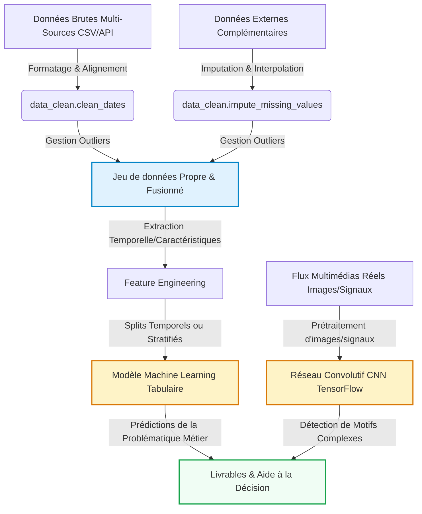

# Mon Projet Data Science
Étudiant(e) 1 : \[Insérer Prénom Nom\], Étudiant(e) 2 : \[Insérer Prénom
Nom\], Étudiant(e) 3 : \[Insérer Prénom Nom\]
2026-05-18

- [Introduction et Contexte Métier](#sec-intro)
  - [Contexte du Projet](#contexte-du-projet)
  - [Objectif Analytique](#objectif-analytique)
- [Lancement avec Docker](#lancement-avec-docker)
- [Acquisition et Préparation des Données (Data
  Wrangling)](#sec-wrangling)
  - [Audit de Qualité](#audit-de-qualité)
  - [Algorithme de Nettoyage](#algorithme-de-nettoyage)
  - [Travaux Pratiques de Wrangling](#travaux-pratiques-de-wrangling)
- [🧹 Jalon 1 : Data Wrangling & Nettoyage (Squelette
  Étudiant)](#broom-jalon-1--data-wrangling--nettoyage-squelette-étudiant)
- [Analyse Exploratoire des Données (EDA)](#sec-eda)
  - [Statistiques Descriptives](#statistiques-descriptives)
  - [Ingénierie de Variables (Feature
    Engineering)](#ingénierie-de-variables-feature-engineering)
  - [Travaux Pratiques d’Exploration Visuelle
    (EDA)](#travaux-pratiques-dexploration-visuelle-eda)
- [📊 Jalon 1 : Analyse Exploratoire des Données (EDA) & Visualisation
  (Squelette
  Étudiant)](#bar_chart-jalon-1--analyse-exploratoire-des-données-eda--visualisation-squelette-étudiant)
- [Visualisation Multidimensionnelle (Insights)](#sec-viz)
  - [Profils et Distributions
    Caractéristiques](#profils-et-distributions-caractéristiques)
  - [Corrélations Globales](#corrélations-globales)
- [Modélisation et Apprentissage](#sec-modelling)
  - [Schéma Global du Pipeline de
    Données](#schéma-global-du-pipeline-de-données)
  - [Modélisation Tabulaire (Machine
    Learning)](#modélisation-tabulaire-machine-learning)
- [🧠 Jalon 2 : Modélisation Prédictive & Apprentissage (Squelette
  Étudiant)](#brain-jalon-2--modélisation-prédictive--apprentissage-squelette-étudiant)
  - [Modélisation Vision / Deep Learning (Analyse d’Images ou
    Signaux)](#modélisation-vision--deep-learning-analyse-dimages-ou-signaux)
- [📷 Jalon 2 : Brique de Vision par Ordinateur (CNN & TensorFlow)
  (Squelette
  Étudiant)](#camera-jalon-2--brique-de-vision-par-ordinateur-cnn--tensorflow-squelette-étudiant)
- [Évaluation Métrique et Validation](#sec-evaluation)
  - [Stratégie de Validation](#stratégie-de-validation)
  - [Résultats et Interprétation](#résultats-et-interprétation)
- [Data Storytelling et Communication](#sec-storytelling)
  - [Recommandations Stratégiques /
    Métier](#recommandations-stratégiques--métier)
  - [Limites et Perspectives](#limites-et-perspectives)
- [Bibliographie](#bibliographie)

# Introduction et Contexte Métier

[](https://github.com/aptitek/aptispace-datascience-projet/actions/workflows/ci.yml)

*À rédiger par les étudiants : Présentez ici le contexte global de votre
projet, la problématique métier que vous cherchez à résoudre, les
questions scientifiques soulevées et les opportunités d’aide à la
décision sur la base de vos données.*

## Contexte du Projet

*À rédiger par les étudiants — Pistes de réflexion :* - *Quels sont les
objectifs globaux et le domaine d’étude de votre projet ?* - *En quoi ce
sujet de recherche est-il pertinent et stratégique ?* - *Pourquoi
l’analyse quantitative de ce jeu de données est-elle indispensable pour
répondre à votre problématique ?*

\[Rédiger votre paragraphe de contexte ici\]

## Objectif Analytique

*À rédiger par les étudiants — Pistes de réflexion :* - *Quelles sont
les variables cibles principales et la tâche globale de modélisation
(classification, régression, clustering, etc.) ?* - *Comment le couplage
de données multi-sources et l’intégration de différents types de données
(tabulaires, images, signaux, etc.) enrichissent-ils l’analyse ?* -
*Quels sont les livrables analytiques attendus pour répondre à votre
problématique et guider les prises de décisions ?*

\[Rédiger votre paragraphe d’objectifs ici\]

------------------------------------------------------------------------

# Lancement avec Docker

Pour simplifier l'installation, vous pouvez exécuter tout le projet dans
un conteneur Docker.

1. Construire l'image

  docker compose build

2. Compiler les notebooks

  docker compose run --rm datascience task compile

3. Générer le rapport complet

  docker compose run --rm datascience task render

4. Prévisualiser le rapport Quarto dans le navigateur

  docker compose run --rm -p 4200:4200 datascience quarto preview report/rapport.qmd --port 4200 --host 0.0.0.0

Prérequis Windows : Docker Desktop doit être lancé avant ces commandes.

------------------------------------------------------------------------

# Acquisition et Préparation des Données (Data Wrangling)

Le succès de tout projet de Data Science repose sur la qualité de la
préparation des données ([McKinney 2020](#ref-pandas2020)). Cette
section documente l’audit de qualité et les étapes de nettoyage
appliquées à vos jeux de données bruts.

## Audit de Qualité

*À rédiger par les étudiants : Présentez un audit critique complet de
vos fichiers de données brutes. Indiquez la liste des anomalies
physiques et typologiques détectées (formats de dates hétérogènes,
outliers physiques, taux de valeurs manquantes, etc.).*

\[Rédiger votre audit de données ici\]

## Algorithme de Nettoyage

*À rédiger par les étudiants : Justifiez et détaillez l’enchaînement de
vos opérations de traitement (uniformisation des dates, masquage des
outliers, imputation, etc.). Faites référence aux fonctions
correspondantes de votre module `src/data_clean.py`.*

\[Rédiger la justification méthodologique ici\]

## Travaux Pratiques de Wrangling

# 🧹 Jalon 1 : Data Wrangling & Nettoyage (Squelette Étudiant)

Ce notebook correspond à la première étape du **Jalon 1**. L’objectif
est d’importer le jeu de données brut (`data/raw/raw_data_sample.csv`),
d’effectuer un audit de sa qualité (données manquantes, anomalies
physiques, formats de dates hétérogènes) et de le nettoyer à l’aide de
votre package personnalisé `src.data_clean`.

### 1. Importation des packages et chargement des données

### 2. Audit initial des données

**À faire par l’étudiant :** Explorez le dataset brut pour évaluer sa
structure : - Quelles sont les dimensions du dataset ? - Quels sont les
types de données par colonne ? - Reste-t-il des valeurs nulles ? Quel
est le taux de valeurs manquantes par variable ? - Y a-t-il des doublons
?

### 3. Nettoyage et uniformisation des Dates

**À faire par l’étudiant :** Appliquez la fonction `clean_dates` de
votre module `src.data_clean` pour convertir la colonne `timestamp` en
type Datetime uniforme.

### 4. Identification et Traitement des Outliers (Anomalies physiques)

**À faire par l’étudiant :** Analysez les valeurs de la colonne `value`
et appliquez votre fonction `handle_outliers` pour filtrer les valeurs
physiques aberrantes (inférieures à 0 ou supérieures à 100).

### 5. Imputation des valeurs manquantes

**À faire par l’étudiant :** Appliquez la fonction
`impute_missing_values` pour remplir les NaNs issus du chargement
initial ou du nettoyage des anomalies.

### 6. Sauvegarde des données propres

Enregistrez votre DataFrame nettoyé dans
`data/processed/cleaned_data_sample.csv`.

------------------------------------------------------------------------

# Analyse Exploratoire des Données (EDA)

Dans cette section, nous analysons les relations statistiques
fondamentales qui régissent votre domaine d’étude au sein du jeu de
données.

## Statistiques Descriptives

*À rédiger par les étudiants : Présentez une vue d’ensemble descriptive
rapide de vos variables nettoyées.*

\[Rédiger les statistiques descriptives ici\]

## Ingénierie de Variables (Feature Engineering)

*À rédiger par les étudiants : Expliquez l’intérêt mathématique et
l’impact sur les modèles prédictifs d’extraire des caractéristiques
dérivées (ex: variables cycliques temporelles, ratios financiers, ratios
physiques, etc.).*

\[Rédiger votre explication de l’ingénierie de variables ici\]

## Travaux Pratiques d’Exploration Visuelle (EDA)

# 📊 Jalon 1 : Analyse Exploratoire des Données (EDA) & Visualisation (Squelette Étudiant)

Ce notebook est dédié à la découverte de relations clés et à l’analyse
visuelle de nos données. À partir du jeu de données propre généré
précédemment, nous allons enrichir nos variables explicatives et appeler
les fonctions de notre module de visualisation `src.utils_viz` pour
générer des graphiques professionnels.

### 1. Importation des packages et configuration du style

### 2. Ingénierie de variables temporelles

**À faire par l’étudiant :** Appliquez la fonction `feature_engineering`
de `src.data_clean` pour enrichir votre DataFrame en caractéristiques de
temps classiques (heures, jours de la semaine).

### 3. Visualisations Professionnelles

#### A. Profils d’évolution et tendances

**À faire par l’étudiant :** Appliquez la fonction `plot_generic_trends`
de votre module `src.utils_viz` pour tracer l’évolution de la valeur par
rapport au temps.

#### B. Matrice de corrélation multi-variables

**À faire par l’étudiant :** Appliquez la fonction
`plot_correlation_matrix` de votre module `src.utils_viz` pour calculer
et afficher graphiquement la carte thermique des corrélations sur les
colonnes `['value', 'hour', 'dayofweek']`.

#### C. Nuage de points bivarié

**À faire par l’étudiant :** Générez un nuage de points de la relation
heure vs valeur en colorant les points selon la variable `dayofweek`, en
utilisant votre fonction `plot_bivariate_scatter`.

### 4. Synthèse des observations clés

Sur la base de vos figures, listez les **insights majeurs** observés sur
le comportement de vos variables.

------------------------------------------------------------------------

# Visualisation Multidimensionnelle (Insights)

Nous présentons ici les résultats visuels clés permettant de dégager des
insights exploitables pour les décideurs, en s’appuyant sur notre module
`src/utils_viz.py`.

*À rédiger par les étudiants : Présentez et commentez en détail vos 3 à
5 insights majeurs découverts lors de l’exploration descriptive
visuelle. Intégrez et justifiez les figures clés générées.*

## Profils et Distributions Caractéristiques

``` python
#| label: fig-distribution-density
#| fig-cap: "Distribution ou profils caractéristiques de vos variables clés."
#| echo: false
# TODO: Utiliser vos fonctions personnalisées de votre module pour tracer la figure
```

\[Commenter la figure et décrire vos observations ici\]

## Corrélations Globales

``` python
#| label: fig-correlation
#| fig-cap: "Matrice de corrélation de Spearman ou de Pearson entre variables."
#| echo: false
# TODO: Utiliser uv.plot_correlation_matrix() de votre module pour tracer la figure
```

\[Commenter la figure et décrire vos observations ici\]

------------------------------------------------------------------------

# Modélisation et Apprentissage

## Schéma Global du Pipeline de Données

Le pipeline complet intègre à la fois la branche analytique tabulaire
(Machine Learning) et la branche d’analyse visuelle ou de signaux
complexes (Deep Learning CNN) :



## Modélisation Tabulaire (Machine Learning)

*À rédiger par les étudiants : Expliquez le choix de vos algorithmes
d’apprentissage (supervisé ou non supervisé) et décrivez l’importance
des variables explicatives.*

\[Détailler votre modélisation ici\]

### Travaux Pratiques de Modélisation Tabulaire

# 🧠 Jalon 2 : Modélisation Prédictive & Apprentissage (Squelette Étudiant)

Dans ce notebook du **Jalon 2**, l’objectif est d’implémenter un
pipeline complet d’apprentissage supervisé pour prédire une variable
cible (`value`) à l’aide de Scikit-Learn.

Vous devrez mettre en œuvre une stratégie de découpage train/test
chronologique pour respecter la causalité temporelle.

### 1. Préparation de l’environnement

### 2. Définition des variables et split chronologique

**À faire par l’étudiant :** - Identifiez vos colonnes prédictives
(`features`) et la colonne cible (`value`). - Séparez chronologiquement
vos données en ensembles d’entraînement (`Train`) et de test (`Test`).
N’utilisez pas de split aléatoire !

### 3. Entraînement du modèle de Forêt Aléatoire

**À faire par l’étudiant :** - Instanciez et entraînez un modèle
`RandomForestRegressor`. - Générez les prédictions `y_pred` sur
l’ensemble de test.

### 4. Évaluation métrique

**À faire par l’étudiant :** Calculez et affichez les scores
d’évaluation requis : - **MAE** (Mean Absolute Error) - **RMSE** (Root
Mean Squared Error) - **R²** (Coefficient de détermination)

### 5. Importance des variables explicatives

**À faire par l’étudiant :** Extrayez et affichez l’importance relative
de chaque caractéristique prédictive.

## Modélisation Vision / Deep Learning (Analyse d’Images ou Signaux)

*À rédiger par les étudiants : Expliquez l’intérêt de la brique de Deep
Learning (images, signaux ou traitement de données structurées
complexes) pour classifier ou enrichir vos prédictions. Détaillez
l’architecture de votre réseau de neurones convolutif (CNN) conçu sous
TensorFlow/Keras (conv, pooling, dense, dropout, activation) et
commentez les courbes d’apprentissage obtenues.*

\[Détailler votre architecture CNN et analyse ici\]

### Travaux Pratiques de Vision par Ordinateur (CNN)

# 📷 Jalon 2 : Brique de Vision par Ordinateur (CNN & TensorFlow) (Squelette Étudiant)

Ce notebook est dédié à la brique d’analyse d’images du **Jalon 2**.
L’objectif est de concevoir un Réseau de Neurones Convolutif (CNN) sous
TensorFlow/Keras pour classifier des motifs géométriques simples (Classe
0: Cercle vs Classe 1: Multiples Rectangles).

### 1. Préparation de l’environnement

### 2. Génération du jeu d’images synthétiques

Pour travailler de manière autonome sans importer de lourdes bases
d’images externes, cette fonction utilitaire génère des images simulées
en $64 \times 64$ pixels de formes simples (Cercle vs Rectangles).

### 3. Split d’évaluation (Entraînement / Validation)

**À faire par l’étudiant :** Divisez vos données d’images `X_images` et
`y_labels` en $80\%$ pour l’entraînement et $20\%$ pour la validation.

### 4. Conception de l’architecture du CNN

**À faire par l’étudiant :** Instanciez un réseau convolutif séquentiel
Keras comprenant des couches `Conv2D`, `MaxPooling2D`, `Flatten`,
`Dense` et un `Dropout` pour classifier nos deux formes géométriques.

### 5. Compilation et Entraînement

**À faire par l’étudiant :** - Compilez le modèle avec l’optimiseur
`'adam'` et la fonction de perte binaire. - Entraînez votre CNN sur
environ 5 époques.

------------------------------------------------------------------------

# Évaluation Métrique et Validation

## Stratégie de Validation

*À rédiger par les étudiants : Expliquez pourquoi le découpage
d’évaluation choisi (ex: validation temporelle, stratifiée ou par
groupe) est adapté à la structure de vos données pour éviter les fuites
de données.*

\[Rédiger la section de validation ici\]

## Résultats et Interprétation

*À rédiger par les étudiants : Complétez le tableau d’évaluation
ci-dessous en reportant vos résultats de modélisation.*

| Modèle | Métrique 1 (ex: MAE / Précision) | Métrique 2 (ex: RMSE / F1-Score) | R² / Score (%) |
|----|----|----|----|
| Baseline (ex: Naïve / Moyenne) | \[À compléter\] | \[À compléter\] | \[À compléter\] |
| **Modèle Choisi** | **\[À compléter\]** | **\[À compléter\]** | **\[À compléter\]** |

\[Interpréter et comparer les métriques d’erreur calculées ici\]

------------------------------------------------------------------------

# Data Storytelling et Communication

## Recommandations Stratégiques / Métier

*À rédiger par les étudiants : Formulez des recommandations
stratégiques, opérationnelles et innovantes basées sur vos découvertes
analytiques et prédictives pour guider les décideurs.*

\[Rédiger vos recommandations ici\]

## Limites et Perspectives

*À rédiger par les étudiants : Identifiez honnêtement les biais ou
limites de votre approche et proposez des pistes d’amélioration futures
(ex: intégration de données externes réelles, modélisation plus
poussée).*

\[Rédiger les limites et perspectives ici\]

Ce document dynamique a été compilé en Quarto ([Team
2024](#ref-quarto2024)).

------------------------------------------------------------------------

# Bibliographie

<div id="refs" class="references csl-bib-body hanging-indent">

<div id="ref-pandas2020" class="csl-entry">

McKinney, Wes. 2020. *Python for Data Analysis: Data Wrangling with
Pandas, NumPy, and IPython*. O’Reilly Media.

</div>

<div id="ref-quarto2024" class="csl-entry">

Team, Quarto Development. 2024. “Quarto Dynamic Publishing System:
Collaborative Scientific and Technical Publishing.”
<https://quarto.org/>.

</div>

</div>
